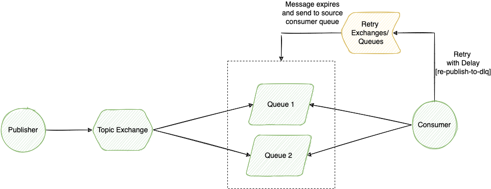

# demo-stream-function-dlx-retry

This example is based on [Spring Cloud Stream](https://docs.spring.io/spring-cloud-stream/docs/current/reference/html/) project with functional model approach.
In this example demonstrated delayed retry pattern through additional queue.

## Reference Documentation
1. [Dead Letter Exchange in RabbitMQ](https://www.rabbitmq.com/dlx.html)
2. [Delayed Retry Pattern](https://medium.com/nmc-techblog/re-routing-messages-with-delay-in-rabbitmq-4a52185f5098)
3. [Retry pattern with RabbitMQ Binder in Spring Cloud Stream](https://docs.spring.io/spring-cloud-stream/docs/current/reference/html/spring-cloud-stream-binder-rabbit.html#_retry_with_the_rabbitmq_binder)

## Notes:
Alternatively a pair fo retry exchange/queue can be replaced with single exchange provided by [RabbitMQ Delayed Message Plugin](https://github.com/rabbitmq/rabbitmq-delayed-message-exchange), which is supported by Spring Cloud Stream(check `delayedExchange` property description in [RabbitMQ Consumer Properties](https://docs.spring.io/spring-cloud-stream/docs/current/reference/html/spring-cloud-stream-binder-rabbit.html#_rabbitmq_consumer_properties)).

More plugins can be found [here](https://github.com/rabbitmq/rabbitmq-delayed-message-exchange).

## Messaging Topology

