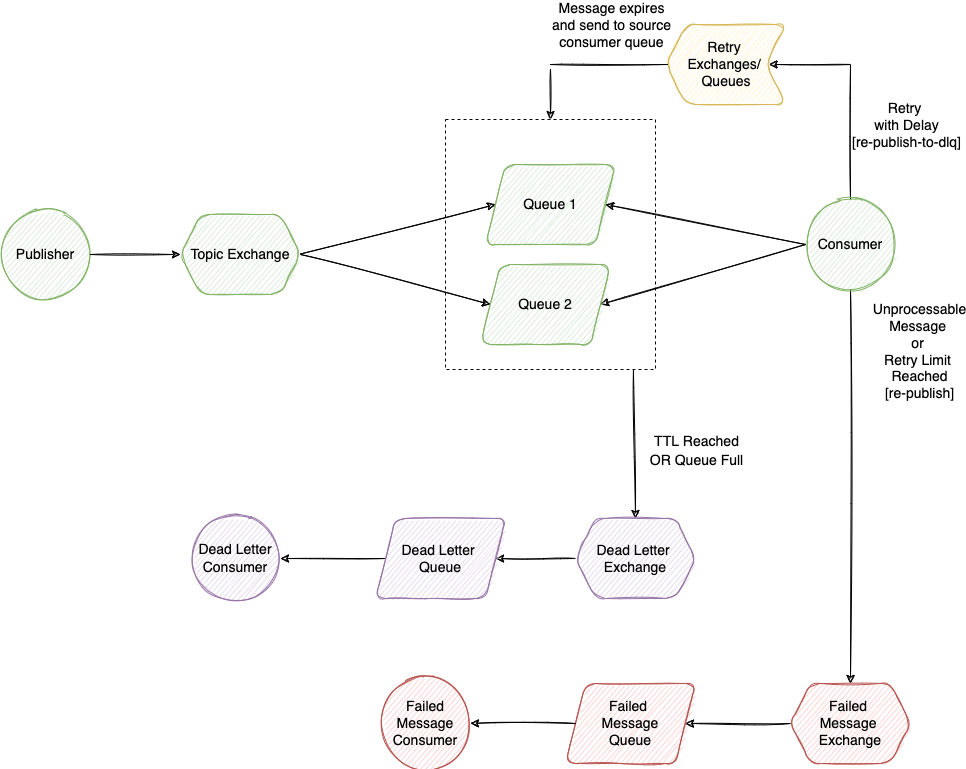

# demo-stream-function-ultimate

This example is based on [Spring Cloud Stream](https://docs.spring.io/spring-cloud-stream/docs/current/reference/html/) project with functional model approach.
In this example demonstrated :
1. delayed retry pattern through additional queue.
2. re-publishing messages to failed queue which exceeded retry limit
3. dead lettering messages which were expired based on queue TTL attribute OR during queue overflow 

## Messaging Topology

