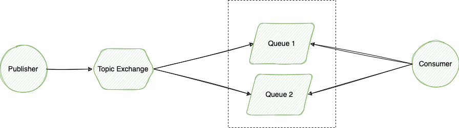

# demo-stream-function

This example is based on [Spring Cloud Stream](https://docs.spring.io/spring-cloud-stream/docs/current/reference/html/) project with functional model approach.

## Messaging Topology

