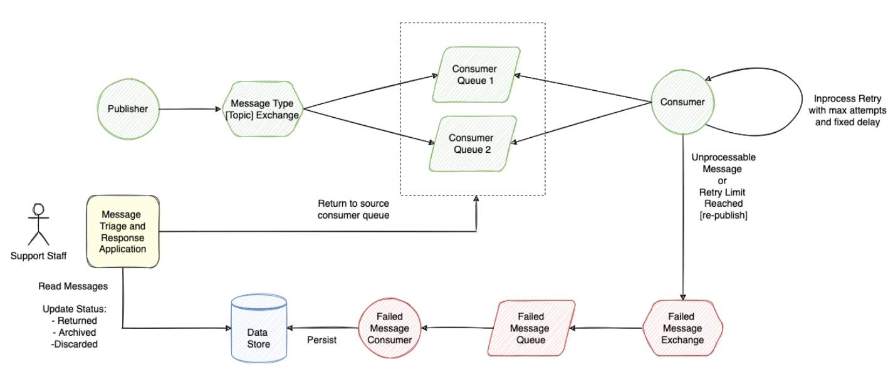

# Hometask Custom Retry with Failed Message Exchange

Third example with custom retry logic is based on [Spring AMQP](https://docs.spring.io/spring-amqp/reference/html/) project.

Retry exchange is not configured as DLX for the source queues. 
Consumer is responsible to re-publish messages for retry. 
If retry limit reached message should be re-published to Failed Message Exchange instead.

## Messaging Topology

## RabbitMQ Configuration:

`RunConfig.class` produces a receipt orders in a loop with 100 delay to **queue-order**

`OrderListener.class` listen the order and update the Status. If status is not UPDATED its republishes to the same queue. After 3 retry exception is thrown. 
The message is routing to dlx queue.

`FailedOrderListener` listens to dlx queue. Stores messages to failedStore

`CacheStorage.class` stores Updated receipts and failed to failedStore.
