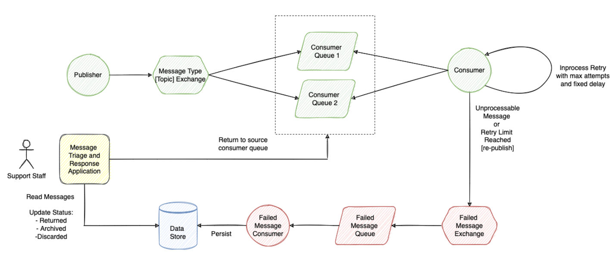

# Retry by using DLX with TTL

Second example with custom retry logic is based on [Spring AMQP](https://docs.spring.io/spring-amqp/reference/html/) project.

Update previous implementation and change retry mechanism from inprocess to retry exchange/queue. 
Retry queue should have ttl, after message expires it should be routed to the source queue.

## Messaging Topology

## RabbitMQ Configuration:

`RunConfig.class` produces a receipt orders in a loop with 100 delay to **queue-order-with-dlx**

`OrderListener.class` listen the order and update the Status. If status is not UPDATED -> throw an ImmediateRequeueAmqpException
If message has been already re-queued -> throw an AmqpRejectAndDontRequeueException

`CacheStorage.class` stores Updated receipts and failed to failedStore.
